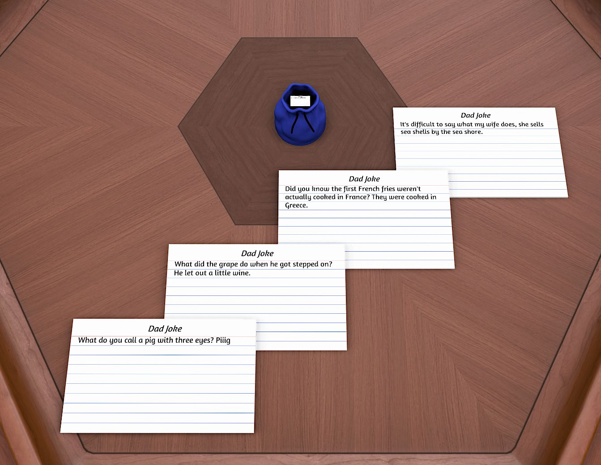

# Endless Dad Jokes

Ever wished your tabletop sessions came with a steady supply of eye-rolls and groans?  
This bag delivers exactly that: every time you pull a notecard from the bag, it fetches a fresh *dad joke* straight from
the internet and writes it onto the card.

No repeats, no setup needed – just terrible puns on demand.

---

## 🎮 Features

- Automatic dad joke generation using the **icanhazdadjoke API**
- Jokes appear directly on notecards as you draw them
- Container has a custom funny title & description to set the mood
- Perfect for icebreakers, filler moments, or torturing your friends

---

## 📝 How to Use

1. Spawn the bag.
2. Pull out a notecard.
3. Read the joke aloud (*bonus points for dramatic delivery*).

---

## ⚠️ Disclaimer

Side effects may include:

- Groaning
- Facepalming
- Sudden urge to tell worse jokes

---

## 📚 Resources

- [Some assets and a copy of the savegame on GitHub](https://github.com/cornernote/tabletop_simulator-dad_jokes)
- [Game on Tabletop Simulator Steam Workshop](https://steamcommunity.com/sharedfiles/filedetails/?id=3561179987)

---
